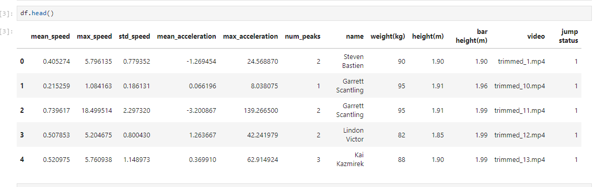
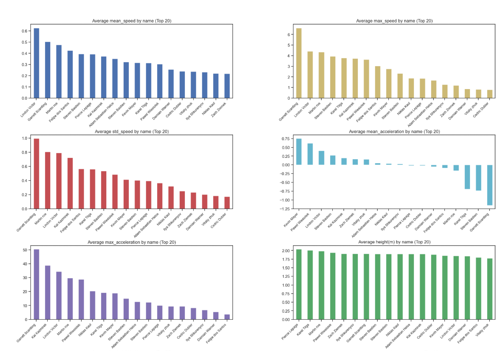
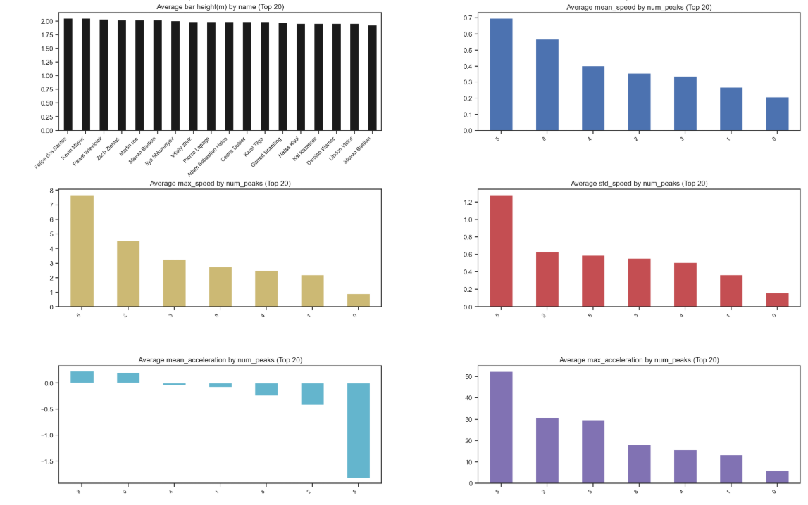
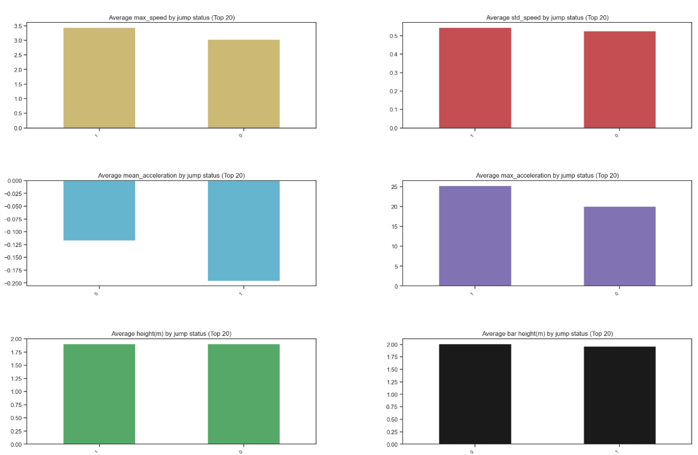
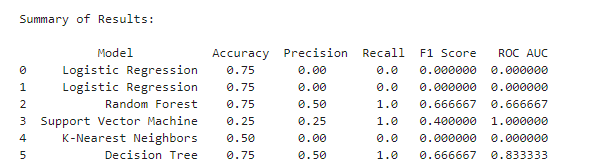

# High Jump Success Prediction

This project uses machine learning to predict whether a high jump attempt will be successful based on data extracted from video analysis. The dataset contains features derived from video recordings, such as the athlete's speed, angle, and position during the jump.

The project implements multiple binary classification algorithms to evaluate their performance and identify the best model for predicting jump success.

See the **training.ipynb** for the code 

## Table of Contents
- [Overview](#overview)
- [Data Description](#data-description)
- [Models and Metrics](#models-and-metrics)
- [Usage](#usage)

## Overview
High jump is a technical and competitive sport where success depends on various biomechanical factors. By analyzing video data, we aim to:
- Improve understanding of the mechanics of a successful jump.
- Provide actionable insights for athletes and coaches.
- Automate prediction of jump success for sports analytics.

This repository implements machine learning models to classify a jump as successful (`1`) or unsuccessful (`0`).

## Data Description
The dataset contains the following features extracted from video frames:
- **mean_speed**
- **max_speed**
- **std_speed**
- **mean_acceleration**
- **max_acceleration**
- **bar_height**
- **height**
- **weight**

Target variable:  
- `1`: Successful jump  
- `0`: Unsuccessful jump

## Models and Metrics
The following binary classification algorithms are implemented:
1. Logistic Regression
2. Random Forest
3. Support Vector Machine (SVM)
4. K-Nearest Neighbors (KNN)
5. Decision Tree

### Metrics Used
- **Accuracy**: Overall correctness of the model.
- **Precision**: Correct positive predictions relative to all positive predictions.
- **Recall (Sensitivity)**: Ability to correctly identify positive instances.
- **F1 Score**: Harmonic mean of precision and recall.
- **ROC AUC**: Measures the ability to distinguish between classes.

## Usage
### Prerequisites
Ensure that you have the dataset split into training and testing sets (`X_train`, `X_test`, `y_train`, `y_test`).

### Analysis and Results

